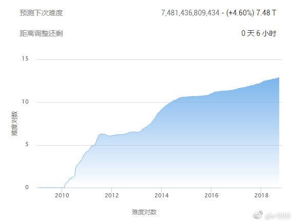
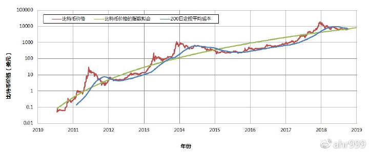
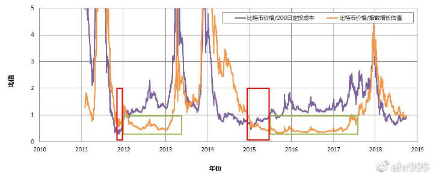

# 第八章 囤比特币：寻找合适的购买时机

> 我们都希望使用有限的投入获得更多比特币，那么何时是合适的买点呢？

**很多比特币脑残粉会告诉你，在任何时候都可以买入比特币。**这话既是正确的，也是不正确的。

正确是因为，放在一个大的时间尺度，任何时间购买比特币，都能获得巨额回报。比如上一轮牛市的顶点是8000元人民币，或许真的套住了一批人，但是只要拿到了今天，仍然是N倍收益。

不正确是因为，每一个囤币者的资金量都是有限的。这意味着，如果你控制得好，可以多获得好几倍的币，例如：你通过定投把平均成本降到2000元人民币，那么你的币量会是高点买入的4倍。那么，根据我们前面的计算，你可以提前1个周期（4年）实现财富自由，这显然也很重要。

**我希望所有囤币者都能够以最低成本持币。**为什么呢？囤币者是市场上的硬手，都是只买不卖的。我当然希望更多的币集中在硬手们的手中，而不希望那些炒来炒去的人拿到太多币，因为他们拿到了也没意义，迟早要吐出来的。

那么，问题来了，**我们如何判断购买时机呢？**

李笑来在《比特币世界简明生存指南》提出：

> **长期来看，我认为可以把矿工成本看做基本面。**

但是，他从来没有解释过原因，因此很多人并不认同他的观点。

**我认为这句话是有道理的。**上一轮熊市最低点的币价是900元，当时吴忌寒接受采访的时候透露，生产一个币的边际成本是800元。这其实间接支持了李笑来的观点。

我们先看看比特币的难度增长（图1），虽然比特币价格起伏很大，但是难度基本没有出现过回调，而是单向上涨。

图1. 比特币的挖矿难度增长（数据来源：btc.com）

这说明，比特币的价格从来没有跌落到当时主流矿机的电费成本之下，否则就会有大规模关机现象出现，算力就会下降，从而造成挖矿难度下降。因此，**电费成本是比特币价格的硬支撑，这一观点，至少在历史上，都是有效的。**

但是，**这种现象在经济学上是不合理的，因为价格是需求决定的，与成本无关。**在理论与事实矛盾的时候，我们需要修正理论，下面我个人的解释。

**比特币的特别之处在于，任何一个人，包括你和我，在准备持有比特币的时候，都会考虑它的生产成本。**因为每个人获得比特币都有两种途径：买币和挖矿。如果你可以通过挖矿以5000美元的成本获得比特币，你就不会用6000美元去买。

在这一点上，比特币与其它商品有本质区别。如果你要购买苹果手机，或葡萄酒，你主要关注的是商品的品质，而不是成本。但是，如果你要购买比特币，你主要关心的则是成本。

成本又是因人而异的。每个人的成本不一样，如果我去挖矿，成本可能是10000美元，所以，对于我而言，当然是直接买划算。

但是，总会有人掌握矿机或电力资源，越大的资金，越有动力与资源结合，实现低成本。而一旦比特币价格接近最低成本线，原本准备投入矿业的资金就不会再投入了，而会选择买币。于是，就解释了为什么比特币的价格从来没有跌落到主流矿机的电费成本之下。

根据这个现象，我们可以做出这样的判断：**比特币价格的下限是当前主流矿机的电费成本**。

但是，即使知道这个，也仍然没有太多可操作性。如果这一轮熊市没有跌到成本线，怎么办？毕竟像上一轮那样跌到900元，是可遇而不可求的机会。

因此，**我们必须在币价相对较低的位置先购买一些比特币，再留一些钱，或者去赚更多的钱，等待可遇而不可求的机会**。

**什么叫相对较低的位置呢**？我们再来看看比特币的历史价格（图2）。

图2. 比特币历史价格和200日定投平均成本

红色的线是比特币的价格，它符合指数增长模型，绿色的线是比特币价格的指数增长拟合线。理论上，只要你在币价（红色线）处于拟合线（绿色线）的下方购买比特币，都是划算的。

蓝色的线是200日定投成本，注意它与200日均价是有区别的。200日均价是算数平均值，200日定投成本是几何平均值。关于二者的区别请自行百度，几何平均值总是小于算数平均值的。

想象有这样一个人，他从200天以前开始定投比特币，每天固定投入1元。一直定投到今天，他的平均成本就是蓝色的线。

**很多人推崇定投比特币，是非常有道理的**。因为定投成本（蓝色线）在绝大部分时间里，都在币价（红色线）下方运行。也就是说，如果你坚持定投，你能跑赢绝大多数一次性买币的人。

**那么，具体在什么区间内购买比特币最划算呢？**同时满足两个条件：

- **比特币价格低于200日定投平均成本，意味着在这个时候买币，可以跑赢定投的人**。
- **比特币价格低于指数增长模型的估值，意味着在这个时候，币价被低估了**。

图2是指数坐标，看不清楚。**我们现在定义两个比值，比特币价格/200日定投成本，比特币价格/指数增长估值。**在这两个比值同时小于1时候，就是比特币价格被低估，并且直接购买比特币比长期定投更划算的时候。

我们看看这两个比值的历史走势（图3）。

图3. 比特币价格/200日定投成本和比特币价格/指数增长估值

历史上出现过两次，两个比值同时小于1。一次出现在2011年底，时间持续2个月；另一次是2015年上半年。**在图3中以红色方框表示。**

在这两个时间段之后，都有很长的时间（超过1年），比特币价格/200日定投成本 > 1，但比特币价格/指数增长估值 < 1，这意味着币价仍然被低估，但直接买币稍逊于定投，但二者差别并不大。**在图3中以绿色方框表示。**

**无论是红色方框，还是紧接着的绿色方框都是非常好的购买比特币时机。时间窗口其实很长，没有必要急于一时，深怕自己错过了什么。**

那么，**我们现在处于什么位置呢**？今天，这两个比值都刚刚跨进小于1的区间，换句话说，**我们可能正在迎来史上第三次最佳囤比特币的时机。**

**考虑到还有一年半比特币就要产量减半了，第三次最佳囤币时机的时间窗口可能有一年左右。**最终能囤积多少比特币，差不多就取决于我们过去的积蓄和未来一年时间内的场外赚钱能力了。

**对比上一轮熊市，在这个区间内，仍然发生过比特币价格的腰斩。**但无论如何，在这个区间内进行定投，成本不会比抄到最低点高多少了。

总结一下，长期来看，我们可以把矿工成本看做基本面。在大多数时间，定投都是极佳的策略。比特币价格同时低于200日定投成本和指数增长估值的时候，就是比特币价格被低估，并且直接购买比特币比长期定投更划算的时候。现在刚刚进入两个比值小于1的区间，我们可能正在迎来史上第三次最佳囤比特币的时机，时间窗口大约一年。

李笑来在《韭菜的自我修养》中说过：

> 梭哈是交易参与者的大忌，任何时候都要保留一定比例的现金。

我完全同意，也不推荐任何人梭哈比特币。如果你真的打算囤比特币，不建议资金量超过三成。关于这个问题，我们后面还会反复涉及到。从各种角度看，梭哈都是不值得的。

***

《囤比特币》会分享我在过去几年囤比特币过程中的思考和经验。写它的目的不是宣传比特币，而是帮助那些已经准备囤比特币的人。如果不看好比特币，最好取关我。是否看好比特币很大程度上与价值观有关，我无意改变任何人的价值观。