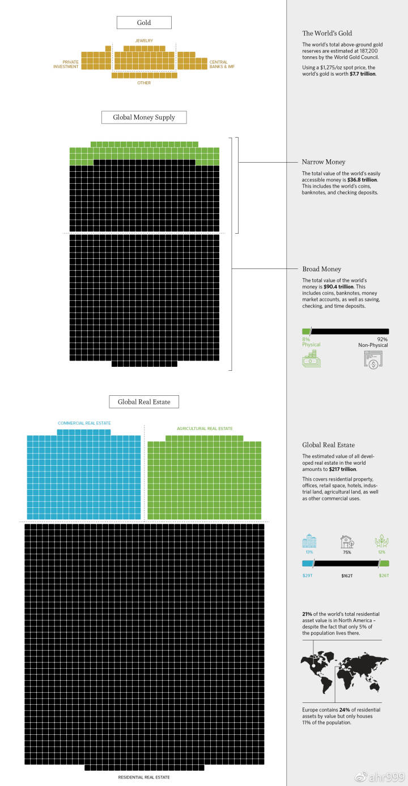

# 第二章 下车太早只因愿景太小

> 比特币十年，有的人来了又走了，有的人走了又来了，有的人来了就不走了，有的人走了就不来了。

绝大多数比特币早期玩家都已经下车，还有很多人眼睁睁看着比特币暴涨就是没上车。这对我们来说是好消息，因为如果他们现在都在车上，币价还能是几万块吗？

犹犹豫豫不上车，迫不及待要下车，原因或许是多方面的，但最主要的，还是因为心中的愿景不够大。

**愿景决定了视野，视野决定了行动。**

* 比特币价格 10 元时，他们说，太贵了。

* 比特币价格 100 元时，他们说，太贵了。

* 比特币价格 1000 元时，他们说，太贵了。

* 比特币价格 10000 元时，他们说，太贵了。

**比特币似乎永远都太贵，他们永远不舍得买。**

* 比特币价格 10 元时，我们说，它还早。

* 比特币价格 100 元时，我们说，它还早。

* 比特币价格 1000 元时，我们说，它还早。

* 比特币价格 10000 元时，我们说，它还早。

**比特币似乎永远都还早，我们永远不舍得卖。**

心中没有愿景，或许还能扛过熊市，但绝对守不住牛市。一涨你就会卖的，千万不要不信，48 万哥就是活生生的例子。

要做到无论牛熊，我自岿然不动，最需要想明白的问题是，它的未来到底有多大？

再涨个百倍？你太悲观，百倍太少，让我来分享我的愿景。

**比特币最核心的应用是储值，它的未来目标就是成为人们的储值首选。**

那么，在比特币出现之前，我们都用什么东西储值呢？也就是说，我们赚了一笔钱，除去消费余下的部分，我们会以什么形式来保存财富呢？它们主要是黄金、货币和不动产。

图1. 世界黄金、货币和不动产总量（修改自http://money.visualcapitalist.com/）

全球黄金的总市值是 7.7 万亿美元，广义货币总量是 90.4 万亿美元，不动产是 217 万亿美元。

* 黄金现在的主要用途就是储值，而论储值，比特币各方面都强于黄金，市值超越黄金只是时间问题。

* 广义的货币包含：现金、定活期存款、证券公司客户保证金，等。除了现金（占比 8%）用于流通，其余部分都是用于储值。

* 不动产主要用途应该还是居住和使用，但是肯定也有相当大的比例是用于储值的。如果不是因为比特币，我应该也会把我的大部分资金用于买房子。由于没有比例可以查，我们暂时假设20% 比例的不动产是用于储值的（这个比例不影响最终结果的数量级）。

**那么，全球总储值市场有多大呢？ 7.7 + 90.4 × 92% + 217 × 20% = 134 万亿。**

**而比特币总量只有 2100 万，大约有 300 万永久丢失。考虑到比特币储值相对于黄金、货币和不动产的绝对优势，每个比特币将涨到 750 万美元，折合 5000 万人民币。**

这就完了？当然没有。

**世界财富总量在以每年 6% 的速度增长，10 年以后总量是现在的 1.8 倍，20 年以后总量是现在的 3.2 倍。因此，假设 20 年后比特币的储值功能得到广泛认可，那时它的价格应该是 1.6 亿元人民币。**

以上计算，仅仅考虑了比特币的储值功能，如果考虑其它因素，比特币的总市值会更高。

换句话说，比特币依然有千倍的增长空间。每 4 年，当产量减半，供应突然减少之后，都会迎来新一轮暴涨。

有时候，我经过城市中最繁华的地段，穿梭于人流，看着人来人往。我就会想，这些人都是做什么工作的？他们的家庭怎么样？他们整天忙忙碌碌追求的是什么？他们中有多少知道比特币？又有多少能理解比特币的未来？

虽然比特币最高涨到过 10 万人民币，但是很显然，人群中的 99% 仍然不理解比特币，仍然没有持有比特币。这当然是好消息，这同样意味着，比特币的上涨空间仍然巨大。

目前，Bitcoin Core 客户端的版本号是 v0.16.2，虽然比特币网络稳定运行了近十年，客户端却仍然没有升级到 v1.0 正式版。**我们其实只是一群测试版用户，真正的用户还没有来呢。**

如果把比特币比做一个孩子，那么这个孩子现在还没有出生，还只是个腹中胎儿。虽然，从一个受精卵成长为胎儿，已经长了千万倍，但未来从胎儿到婴儿到儿童到成年，仍有无穷的成长空间。