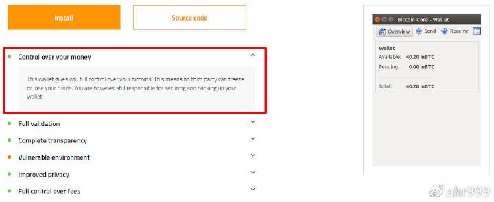

# 第六章 囤比特币：如何管理私钥？

> 通过囤比特币实现财富自由，私钥管理是唯一需要掌握的技能。

通过前面几篇文章：

- 《[比特币与理想主义](di-yi-zhang.md)》我们在参与一场社会实验，它存在失败的可能性，但是我们无怨无悔。
- 《[下车太早只因愿景太小](di-er-zhang.md)》这场实验的目标很大，如果一切顺利，比特币的价格可能会在20年后涨到1.6亿人民币。
- 《[囤比特币：你离财富自由还有多远？](di-san-zhang.md)》我们没有其他能耐，只能靠囤积比特币，并耐心地等待属于自己的财富自由。
- 《[囤比特币：冲动、孤独、无聊与矛盾](di-si-zhang.md)》虽然会经历冲动、孤独、无聊和矛盾等心理考验，但是我们已经做好准备囤币。
- 《[囤比特币：手握私钥的快感](di-wu-zhang.md)》掌握私钥有点麻烦，但是我们仍然准备自己对自己负责。

***

我们终于下定决心要自己掌握比特币私钥了，于是**我们立刻就会面临下一个问题：如何管理私钥？**

这个问题很重要，不过我原本是不准备回答的，因为如果你不能通过自己搜索找到问题的答案，那么你就不配拥有比特币。但是，因为问的人很多，最终我还是决定分享一些心得。

**本文不会介绍详细的教程，也不会推荐任何钱包。**这是因为比特币发展很快，各类钱包软件更新迭代也很快，教程也很快就会过时。如果你一定要教程，网上也是有的，虽然我也不知道它们是否过时了，你姑且可以尝试一下。

- 《[比特币冷钱包到底应该怎么做？](https://www.8btc.com/article/47039)》
- 《[“比太钱包”用户体验报告](https://www.8btc.com/article/21665)》

**本文的重点是，分享私钥管理的一些原则，无论软件如何更新迭代，这些原则是永不过时。**

## 根据安全性需求分级管理私钥

每个人对安全性的需求是不一样的，而同一个人在不同应用场景对安全性的需求也是不一样的。因此，**不可能有一种通用的私钥管理方法适用于所有人或所有应用场景**。

另外，安全性与易用性通常是一对矛盾，任何私钥管理方案其实都是在安全性和易用性之间进行平衡和取舍。

于是我们就需要分级管理私钥。**对于普通比特币用户而言，通常分两级就够用了：高安全等级和低安全等级。**

比如，你现在拥有10个比特币，其中9个准备长期持有，几年都不会动，另外1个需要经常拿出来使用。现在，你有三种方案可以选择：

- 把10个比特币全部放在1个冷储存（安全）；
- 把10个比特币全部放在1个热储存（易用）；
- 把9个比特币放在冷储存（安全），把1个比特币放在热储存（易用）。

第三种方案，就是分级管理，既保证安全又兼顾易用。第一种方案使用起来很不方便，第二种方案将那9个长期持有的币置于不必要的高风险之中。

**由于我们是囤币用户，大部分币都要囤到10-20年之后，因此接下来，我只介绍在进行高安全等级私钥管理时的原则。**

## 管理私钥而不是管理钱包文件

**长期囤币，必须直接管理私钥。**很多人虽然已经开始使用比特币，但是仍然不知道私钥为何物。关于私钥是什么，私钥和地址的关系是什么，请参考：

- 《[精通比特币 – 第4章 密钥、地址、钱包](https://8btc.com/article-1786-1.html)》
- 《[比特币的私钥，公钥和地址是什么？](https://www.8btc.com/article/126232)》

在《[囤比特币：手握私钥的快感](di-wu-zhang.md)》中，我简单讲述了我第一次制作冷钱包的方法，那时我还是小白，所以我在管理钱包文件。这个方案至今仍是安全的，但是我现在已经不用了。

**为什么我们要直接管理私钥呢？**因为软件迭代速度非常快，升级频繁，消亡也快。

4年前，我们很多人用的是一款叫作 multibit 的钱包（https://www.multibit.org/），现在这款钱包已经停止更新了。如果你当年存的是 multibit 的钱包文件，现在你就打不开这个文件了。就算你当时也备份了软件，仍然存在风险，因为软件长时间没人维护，漏洞也没人修复。

没有人能预测10年后的景象，也没有人能知道我们今天使用的钱包能否活到10年后。也没有人知道这10年间，比特币还会发生多少次分叉。

所谓得私钥者得天下，这天下也包括分叉币的天下。你在高点卖掉你不看好的分叉币，既可以获利，又可以让该分叉的操纵者痛不欲生。

所以，请直接管理私钥，而不是钱包文件。事实上，你甚至都不需要一个钱包，你需要的只是一个能随机生成地址和私钥的工具。这个话题要稍微高级一点，大家有空可以自学，其实也不麻烦。

## 冷私钥管理的基本方案

制作冷私钥的步骤如下：准备设备（废旧手机或废旧笔记本电脑），下载软件（钱包等能离线生成地址和私钥的工具），断网（甚至可以把网卡毁掉），离线生成地址和私钥，加密并备份私钥（直接存文本并加密）。

完成冷私钥制作之后，你只需要向该私钥对应的地址转账比特币，并使用其它联网设备在区块链浏览器中查询该地址的交易记录和余额即可。

至于选择哪个钱包工具，可以参考（https://bitcoin.org/en/choose-your-wallet），它对每个钱包都有一个简单的介绍：

图1. Bitcoin Core 钱包简介

**最重要的是第一条，一定要选择“Control over your money”的钱包，凡是第一条不是这个的钱包都不要用。**

## 实战之前一定要测试

由于冷储存的币一般数额都比较大，一旦出错，损失也非常高。所以，无论你选择了什么方案，你都需要先使用少量的币，进行测试。测试也是加深理解的过程，通过反复测试你还可以不断地改进方案。直到你非常确定，方案安全可靠，就可以正式使用了。

## 需要几个备份？

备份少了很危险，因为私钥一旦丢失，比特币就全部损失了。备份多了也很危险，因为备份越多，私钥越容易暴露。**经过我个人的长期摸索，3个备份应该最合适。这3个备份在形式要有差异，储存地点也要分散。**

电子备份和纸质备份各有优劣。电子产品长时间放置，可能会出现故障而打不开。纸质版虽然不会出现故障，但可能墨迹会消失或者模糊。**建议：2个电子版+1个纸质版。**

如果3个备份放置在同一个地点，一旦发生火灾，或者遭遇盗贼，很可能一锅端了。**建议：3个备份分别存在3个安全的地点。**这一点很难，既要足够分散，又要足够安全。

## 私钥是否需要加密？

私钥加密有风险，因为一旦忘记密码就全部损失了。私钥不加密也有风险，因为一旦被盗就立刻损失了。**建议：使用自己最常用、记得最清楚的密码加密。**

你不必担心这密码不够强不够安全。**加密的目的是防贼，密码并不需要特别复杂，能拖延足够时间即可。**比如：某天你发现家里被盗了，由于盗贼破解密码需要时间，这样就为你争取了时间，去用其它备份把币转移了。加密工具有很多选择，即使使用压缩软件自带的加密也够用。

## 需要管理多少私钥？

**随意。**你既可以把币都存在1个地址，这样管理1个私钥就够了；也可以把币分散到N个地址，管理N个私钥。管理难度本质上没有差别，多1个私钥也就多1串字符。

**把币分散到N个地址有优点。**比如，你有9个比特币，分散到9个地址。某天你需要使用<1个币时，你可以直接把某1个私钥导入热钱包使用，而完全不影响其它8个私钥的安全性。对于囤比特币而言，大量卖币的可能性不存在，所以推荐把比特币分散到多个地址中。

## 防范自己出意外

什么叫囤在自己手里？有且仅有你掌握了能够动用这些比特币的私钥。**这意味着一旦你发生意外，你的比特币也跟着全部损失了。**这就是比特币的特性，真正属于你个人的财富，不能与他人分享。

但是，**你仍然可以选择把私钥备份交给一个你百分之百信任的人。**你需要特别叮嘱他，只有你出意外，他才能动私钥。

为什么呢？**因为私钥管理是有难度的，共用私钥最终极有可能导致信任关系破裂。**比如，某天你发现比特币被盗了，可能是你的疏忽，但你并不知道，你就会开始怀疑对方。当然，也有可能是对方背叛了你，但不承认。总而言之，这事就说不清了。

所以，**对方在保管你的私钥时，需要非常明确的知道，他所承担的风险和责任。反之亦然，如果你获得别人的信任，帮他保管他的私钥，你也需要非常明确的知道，你所承担的风险和责任。**

而且，一旦你决定要把私钥备份交给他人，**你不仅仅需要绝对信任对方，也需要做好心理准备，万一被背叛了，你也无怨无悔。**否则，你就不要把私钥交给任何人。但这并不代表，你不能把比特币分享给他人，你可以把比特币转给他人，让他自己保管自己的私钥。

## 还是觉得太麻烦？

**那你就用硬件钱包吧，要买就买2个，加上1个种子卡，正好3个备份，有电子版有纸质版。**

硬件钱包最大的风险是硬件被人做手脚，尤其是在运货阶段。曾经就有人购买二手硬件钱包，结果被人做了手脚，导致丢币。因此，请原厂下单，收货的时候仔细检查包装和封条是否完好，收到之后，先少存点币玩上个半年，币量逐步增加。

你仍然需要明白，**硬件钱包还是没有直接管理冷私钥安全。但是，对于一个啥都不想学的人来说，已经是最好的方案了。**

***

## 后记

刚开始，我是拒绝写这篇文章的。因为我始终认为，如果连这都需要我教，可能也不适合比特币吧。看起来，财富自由的吸引力还是不够大嘛。

但是，问这类问题的人又很多。我也曾经小白过，也很希望得到前辈们的指点，这样就不用走弯路了。我能理解大家的心情，于是就硬着头皮写了。或许还是没有大家想象的那么详尽，真的很抱歉。

我已经很长时间没有使用过钱包软件了，所以我也不知道该如何推荐。除了电脑上还保留1个热钱包，用的是几年前版本的Electrum，存了点币以备不时之需，其它所有钱包全部卸载了。

**事实上，囤比特币也不需要任何钱包软件，你们终究会明白的。**