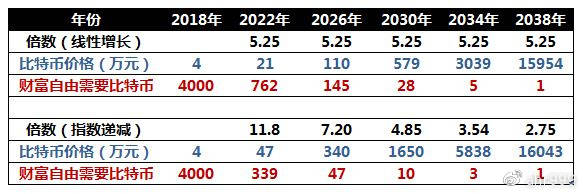

# 第三章 囤比特币：你离财富自由还有多远？

> 哪怕明知囤比特币可以实现财富自由，你可能还是囤不住，因为你不想等，你还想走捷径。

读这篇文章之前，你应该首先认同我前面两篇文章的观点：

* 《比特币与理想主义》，我们在参与一场社会实验，它存在失败的可能性，但是我们无怨无悔。

* 《下车太早只因愿景太小》，这场实验的目标很大，如果一切顺利，比特币的价格可能会在 20 年后涨到 1.6 亿人民币。

如果你不认同上述观点，你就没有必要往下读了。

很多人读了《下车太早只因愿景太小》，留言说，我的预测太大胆。这篇文章会告诉你，我 的预测有多么保守。

**如果 20 年后比特币可以涨到 1.6 亿元，那么它每年需要涨多少呢？**

我们都知道，比特币的供应每 4 年就会减半，每 4 年供求关系的平衡就会被打破，供应变得 紧缺，而需求仍然持续增加，因此币价会迎来一次暴涨。过去的两次减半，都导致了暴涨。

如果 5 个周期后，也就是 20 年后，比特币可以涨到 1.6 亿元，每个周期需要涨几倍呢？

我做了两种计算：

* 一种我称之为“线性增长”（其实数学上并非线性），认为每个周期增长的倍数一样；

* 一种我称之为“指数递减”，认为刚开始增长倍数高，后面增长倍数低。

结果如下：

表1. 两种增长模型的比特币价格预测

**如果是线性增长，每个周期仅仅需要涨到5.25倍。**4年后，比特币价格21万元；8年后，比特币价格110万元；12年后，比特币价格579万元；16年后，比特币价格3039万元；20年后，比特币价格1.6亿元。

**每个周期5.5倍，意味着，每年比特币只需要相对于上一年增长50%。**请问，现在还有人认为我的愿景很大么？我真的很保守耶！

为什么20年涨到1.6亿元，人们会认为激进；而每年增长率50%，人们会认为保守呢？**因为，人们往往会低估复利的威力。**

当然，线性增长模型并不合理，事物的发展总是开始快，后来慢，最终趋于平稳。

如果是指数递减增长，每个周期的倍数依次是：11.8倍，7.2倍，4.85倍，3.54倍和2.75倍。这个模型预测，下一个周期（到2022年）比特币会涨12倍左右。考虑到上一个周期涨了几十倍，这个增长速度基本也是合理的。

## 囤币：我们需要多长时间可以实现财富自由？

一线城市财富自由的门槛是2.9亿（请自行百度）。在这里，我们放宽一点要求，把门槛降低到1.6亿元，也就是20年后1个比特币的价值。

根据指数递减增长模型：

- 如果你想4年后实现财富自由，你需要拥有339个比特币；
- 如果你想8年后实现财富自由，你需要拥有47个比特币；
- 如果你想12年后实现财富自由，你需要拥有10个比特币；
- 如果你想16年后实现财富自由，你需要拥有3个比特币；
- 如果你想20年后实现财富自由，你需要拥有1个比特币；

**很多人会告诉你，拥有1个比特币，未来你就可以财富自由。我认为我百分比认同。**

但我的问题是，你是否愿意等20年？或者你到底愿意等几年？或者你现在能买得起几个币？

现实是，以今天的币价，绝大多数人拿出10%-30%的资产，只能拥有10个或更少的比特币。因此，想要通过囤币实现财富自由，需要至少12年。你是否已经做好了长期囤币的打算？

**所以，哪怕你明知囤币可以实现财富自由，你也囤不住的，只因为你等不了这么久。**

矛盾之处恰恰也在这里。你买1个币，需要等20年才能财富自由，你觉得太久，不愿意等，很懊恼。但是，如果你不买，4年之后，你可能连懊恼的机会都没有了，因为那个时候，你连1个币都买不起了。

## 我们是否有捷径可以走？

**首先，你可能需要反省一下，是不是自己的要求太高了？**绝大多数人，这辈子都没有实现财富自由的可能性，能够实现财富自由的是极少数。囤1个比特币，等上20年，除此之外啥都不需要干，已经是捷径中的捷径了。

**其次，疯狂提升圈外赚钱能力，多赚法币多囤币，可以缩短实现财富自由的时间。**但是，要缩短1个周期，币量大约要翻3-4倍，对每个人来说都是很艰难的。我选择的就是这条路径，至少很稳。

**再次，快速实现财富自由的途径永远存在，也可以不局限于币圈，但总体上概率极低。**万众创新，那么多企业，又有几家能成为拼多多呢？我也在践行这条路径，但是我不抱什么希望。

**人往往就是这样，其实已经走在捷径上了，还在拼命的到处找捷径。**

## 在币圈各种折腾，行不行？

当然也行。很多币圈老人都在折腾，但是除去少数人，绝大部分人的结果并不算理想。

你需要明确一点，**在币圈想赚币往往更难，甚至不如从圈外赚钱来买币。**原因很简单，比特币总量有限，固定2100万。

**圈内每个人都想赚币，而且入圈人数越来越多。**10 万人玩的时候，平均每人 210 个币；等 到 100 万人玩的时候，平均每人只有 21 个币。这就是为什么，玩着玩着，大家手上的币都越来 越少了。反而是那个在圈外赚钱来买币的人，啥都不干，币却越来越多，成了收益最高的人。

**很多人玩亏了币，不甘心，就需要做一些事情找补回来。**这很容易理解的，原来几千币，玩 了一段时间变成几百个，是你你甘心吗？于是，你开始想办法赚回来，可是想赚回来又谈何容易呢？ 于是你不得不去想一些损招。

**圈内有几类人是赚币的，**大家其实也都知道是哪几类，所以，**下面是我的个人建议：**

如果想玩山寨币空气币，你应该去发币，而不是给别人发的币接盘，帮别人实现财富自由。 很多币圈老人都在发币，虽然我很反感，但是我不反对，因为人人都有骗傻逼的自由，而道德只 能用来约束自己。

如果想玩杠杆期货，你应该去开交易所，在自己的交易所割韭菜，而不是去别人的交易所， 被别人割了还是小事，关键还要被别人骂傻逼，就很憋屈了，更有甚者，输了要死要活的，就更不值了。

如果想玩挖矿，你应该去造矿机，或者建矿池，或者有电厂，而不是买矿机或者云挖矿，行 情好的时候赚一点点辛苦钱，行情不好的时候自己承担了全部风险。

总而言之，在圈里混，你需要想方设法把别人的币弄到自己兜里来，争取早日实现财富自由。 如果你没这些能耐，那你或许应该像我这样，耐心地等待。

最后，衷心祝愿我的每一位读者都能最终实现财富自由。