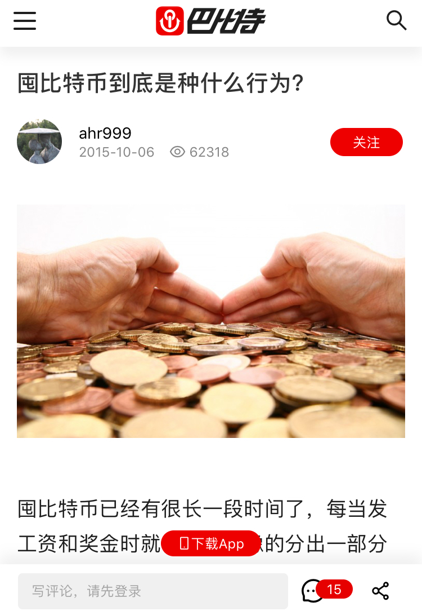

# 第十二章 囤比特币：心中无币

> 当理解上升到一定程度，我们不再需要关注任何比特币相关的信息。

前段时间有人问我，为什么现在才提出囤比特币，比特币价格都几万元了，以前比特币价格低的时候，却没有提。

这真的是冤枉啊。整整3年前，比特币价格只有1545元的时候，我就在巴比特发表了囤比特币的文章《囤比特币到底是种什么行为？》，有图有真相，尽管当时的我对整个体系的思考没有现在这样系统。

图1. 2015年10月6日发表的文章截图

但是，在接下来的3年时间里，我确实极少提到囤比特币。这3年一共大概写了不到10篇文章，多是关于比特币扩容的，主要因为有些别有用心的人混淆视听。对比我最初在彩云比特的半年，翻译和写作200多篇文章，确实是太少了。

事实上，**我把对比特币的注意力，几乎全部卸载了。**

除了还保留了1个热钱包，其实也极少用，我把所有的比特币相关软件全都卸载了。我根本不看行情，不看新闻，也不看大V们的言论。

很多人让我推荐钱包，我真的无法推荐，我都卸载钱包好多年了。

**为什么要这么做呢？**

**首先，99%以上的信息对囤币者而言，毫无意义。**因为无论别人怎么说，无论行情怎么走，无论ETF是否通过，囤币者都是只买不卖的。

时间和精力才是我们最宝贵的资源，如果花费大量时间和精力，就算能赚点币，也不一定就值得。更何况大多数人是亏币的。

**其次，我们需要“空杯心态”。**何谓“空杯心态”？如果想学到更多学问，先要把自己想象成“一个空着的杯子”，忘记以前学的其它内容，用全新的视角思考问题。

把注意力全部放在比特币上，你就没有心思学习其它内容了。长此以往，你会走火入魔。牢记，比特币并不是生活的全部。

**再次，如果你确实囤过一段时间的比特币，你已经高出别人很多了。**从入门阶段自己掌握私钥，到进阶阶段进入币本位思维，你对比特币的认识已经超过了99%的人，包括各种大V。你没办法再去阅读低水平的内容，你会觉得侮辱智商。

财经大V们有个通病——讲的全是正确的废话。你读起来觉得全都正确，但是，你真正想要操作的时候，却发现无从下手。

《囤比特币》系列，既告诉你为什么囤比特币，也告诉你应该如何囤，甚至连（四年后、八年后、十二年后的）结果都告诉了你。而且，永远接受大家的检验。

大道至简的意思是，具备把复杂的问题简单化的能力，看问题抓主要矛盾。卖课程或者收群费的大V们会告诉你，没有大道至简，所有大道至简都是骗人的。这就是把简单问题复杂化，让你觉得很高深，有东西可以学，于是付钱买课程。

真正赚钱的人是不会开班开收群费的。一个炒币能赚钱的人，会在乎你交的那点群费吗？一个囤币就财富自由的人，会去开收费群吗？不多说了，说多了得罪人。

而且真正管用的信息往往是免费的。比如，关于囤币，包括我在内的很多人，早在3年前就免费告诉大家了。只是很多人不相信有这么容易的好事而已。

**最后，卸载掉一切软件之后，卖币会变得很困难。**因为，你需要重新下载并测试新版的软件，然后才能发送币，没有大半天时间是搞不定的。而只要一想到这么复杂，你通常就放弃了。

**卸载一切是囤比特币进阶阶段的考核标准，因为囤比特币只需要私钥，连钱包都不需要，其它就更不需要了。**

我知道，很多读者根本就没有去按照我文章写的内容去做。他们问了很多问题，但我是不会去回答的。因为只要你囤过比特币，你就问不出这种问题。而如果你什么都还没有做，我也无意劝你去囤比特币。

甚至，**我推荐大家在达到进阶标准（卸载一切）之后，把我也取关了**。即使不取关我，等我写完《囤比特币》，我也基本不再刷微博了。**四年后，咱们再见。**

另外，卸载一切与三成资金囤币也是相关的。只有你投入量不大的时候，你才有可能做到卸载自己的全部注意力，否则，你根本办不到的。

于是，**我们在这里系统的梳理一下三成资金囤币的问题**：

- 比特币仍然是实验，风险很大。理性的决策不支持投入过高的资金。
- 要保持富足心态，就不能投入过高资金，否则，贫穷心态导致智商变低，不利于长期囤币。
- 要做到卸载一切，也不能投入过高资金。

**接下来，我们就真的没事可做了，但是，学习不应该停止。**如果还想继续深刻理解比特币，还有些内容可以学习，推荐学习几个方面的内容：

- **批判性思维**：这既是一种精神，也是一种技能。觉得免费的东西不值钱，就是因为你对信息缺乏鉴别能力。无论免费还是收费，我们对信息的质量要有自己的判断标准。
- **经济学原理**：不要只读奥派，不要只读一家之言。读一读经济学导论、宏观经济学、微观经济学的相关内容，重点理解货币制度、通货膨胀、储蓄、投资和金融，等方面。
- **密码学原理**：重点理解概率论、Shannon理论、公钥密码学、椭圆曲线、Hash函数、数字签名、伪随机数生成，等方面。
- **心理学**：重点理解认知过程、情绪、压力、健康、行为和态度的相互影响，等方面。

**希望大家能忘掉比特币，从更广的视角去学习这些内容。另外，囤币之后的学习可以非常轻松，因为你读书和学习，不是为了养家糊口，而是纯粹的丰富自己**。毕竟你有比特币这个后盾，未来大概率是不缺钱的。

此外，**请一定要维护好自己的人品，保护好自己的身体。**

资本可以调配资源，放大我们的梦想。但是，资本在不同的人手里，对社会的贡献是不一样的。这既跟掌握资本的人的学识有关，也跟他的人品有关。

既然大家未来都可能非常的不缺钱，那么请从现在起，维护好自己的人品，不要骗人，也不要去做伤害他人的事情，而是多考虑造福他人。人品这东西，一旦败光了，花钱都买不来。

保护好身体，其实也不容易。很多人知道健身的益处，但是知道也做不到。就像很多人知道囤币的收益，同样知道也做不到。

**最后，我想谈一谈价值观的问题。**

什么是价值观呢？简单的说就是个人喜好。

比如说，某地计划建一个工厂，优点是拉动当地经济，缺点是消耗资源能源。

基于同样的事实，有的人支持建工厂，而另一些人会反对。为什么呢？因为前者认为拉动经济更重要，可以牺牲一点资源能源；而后者认为保护环境更重要，经济发展可以缓一缓。分歧的本质来源于价值观的差异。

价值观本身并没有对错之分，就像萝卜青菜各有所爱，你不能说喜欢萝卜的人就不对。于是以上问题问题，以及所有类似问题，往往会争论不休。

类似的，**几乎所有关于比特币的问题，最终都可能是价值观的问题。**例如：

- PoW维护了比特币价值网络，但消耗了巨量能源。是否值得？你认为值得就值得，你认为不值得就不值得。
- 比特币实现个人私产的自由，但是去中心化无法被监管也无人背书导致乱象丛生，是否值得？你认为值得就值得，你认为不值得就不值得。
- 比特币为了保证去中心化和安全性，适当放弃了主链的交易速度和容量，是否值得？你认为值得就值得，你认为不值得就不值得。

类似的问题还有很多，**我对上述问题的答案都是——非常值得**。我坚持自己的价值观，也尊重别人的价值观，所以我不会就上述问题与他人争论。

**我的价值观与比特币的价值观一致，如果你也是如此，那么相信我，比特币就是属于你的，你也一定能囤得住比特币的。**

**进阶阶段就全部结束了。**现在，你已经知道了比特币的价值来源，以及在什么时间购买比特币，懂得理性的决策，按照币本位在生活。你做到了！

**手中有币，心中无币。**