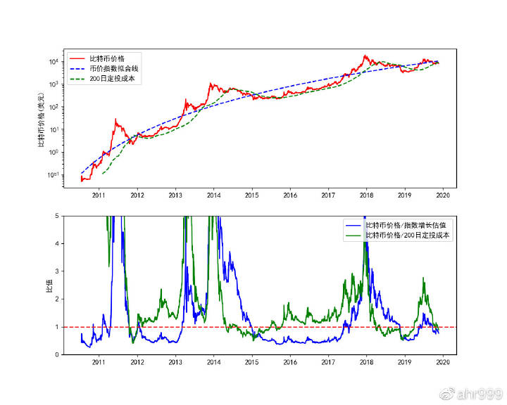
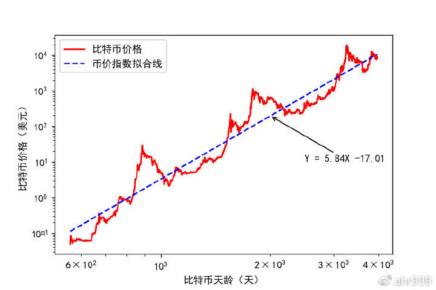
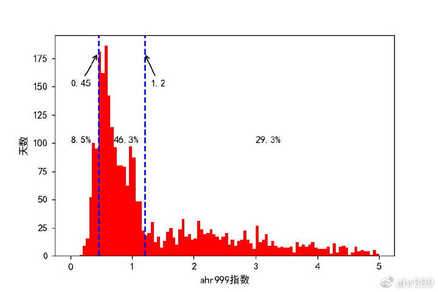
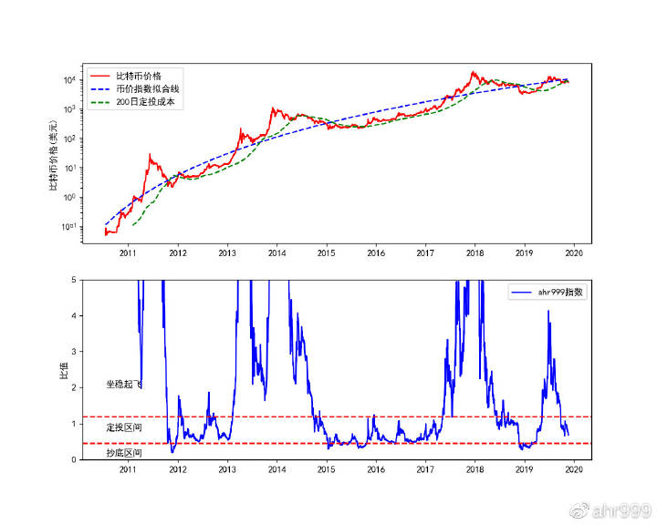

# 第十五章 囤比特币：ahr999 指数

一个指数告诉你什么时候可以抄底！

自从《[囤比特币：寻找合适的够买时机](di-ba-zhang.md)》和《[寻找合适的购买时机（20190804更新）](http://btc.mom/?p=2687)》发表之后，不断地有人问我，文章里面的拟合曲线是如何计算的。

今天这篇文章，就是详细介绍曲线的算法，同时提出一个新的指数——ahr999指数，用于指导我们寻找合适的购买时机进行囤比特币。

废话不多说，先上图。

这两张图大家应该很熟悉了。上面的图红色的线是币价，蓝色虚线就是币价的指数拟合线，绿色的线是200日定投成本线。当币价（红线）低于指数拟合线（蓝线）和200日定投成本线（绿线)时，就是很好的囤币时机。

很多人的疑问是，蓝色的虚线，即指数拟合线怎么得来的。

其实很简单，我们看下图：

这个图是币价对币龄的图，都是对数坐标。币龄就是比特币出生了多少天（比特币的生日是2009年1月3日）。我们发现，在这张图上，币价对币龄呈现线性关系，拟合的结果是Y = 5.84X- 17.01。那么，换回普通坐标，币价和币龄就是指数关系：币价 = 10^[5.84log(币龄)-17.01]。

把这个公式放到第一种图中，就是那条蓝色的曲线。这是个拟合结果，随着币价的不断变化，拟合结果也会跟着发生变化。但因为拟合数据是过去8年的币价，因此短期币价的变化对拟合结果的影响非常小。

好了，拟合线怎么来的，就介绍到这里。现在，我们再往前走一步。

之前，我们定义了两个比值，比特币价格/200日定投成本，比特币价格/指数增长估值。在这两个比值同时小于1时候，就是比特币价格被低估，并且直接购买比特币比长期定投更划算的时候。

但是，毕竟同时看两个比值比较麻烦，而且两个比值同时小于1的情况很少。为了简化问题，我们定义一个新的参数，我叫它ahr999指数。

**ahr999指数 = （比特币价格/200日定投成本） \* （比特币价格/指数增长估值）**

其实，很简单，就是把两个比值相乘，然后，我们看这一个指标就够了。

首先，我们分析一下，ahr999指数在历史上的分布，见下图。

我们发现，只有8.5%的时间，ahr999指数小于0.45，这就是抄底区间；有46.3%的时间，ahr999指数在0.45与1.2之间，这就是定投区间；有29.3%的时间，ahr999指数在1.2与5之间，这就是等待起飞的区间。当然，还有ahr999指数大于5的时间，不过我们不准备卖币，所以不考虑了。

然后，我们再来结合ahr999指数看币价的走势。

怎么样？今天的ahr999指数是0.68。你对后续走势，有什么看法？欢迎留言。