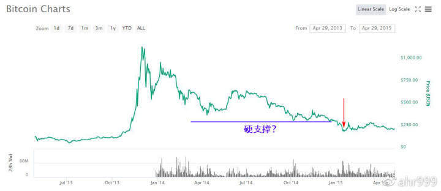
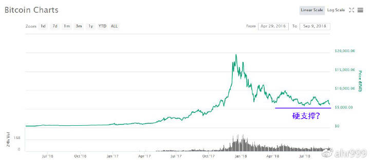

# 故事二 上一轮熊市

> 从8000元到900元，我们都经历了些什么？

- 有些事情不亲身经历一次，你永远无法体会其中的滋味。

- 新人们没有经历过上一轮熊市，但是已经开始体会到熊市的残酷。

- 你也许会好奇，上一轮熊市都发生了什么？老人们都是如何扛过去的？

- 本文分享我在上一轮熊市的经历和见闻，供各位参考。

- 成文仓促，没逻辑，想到哪里说哪里！

***

我是上一次熊市入场的，之前的熊市是什么状况，我也不知道。那时我也好奇，也查阅过一些帖子，从别人的只言片语中，大概了解了32美元跌到2美元的惨状，但并不觉得那会有艰难。

所以，我入场来了，信心满满的来了。我自认为学习能力强，我自认为能应对熊市。回过头来看，我确实做了很充分的准备，我也没有犯什么致命错误，但是我也还是差点承受不住。

让我们首先一起来回顾一下币价的变化。

图1. 2014年比特币走势（数据来源：coinmarketcap.com）

光看这张图，根本看不出有什么残酷的，从2013年11月最高8000元跌到2015年1月最低900元（红色箭头的位置），跌幅接近90%。

在这张图上的任何一个时间点，买币囤到今天，都是N倍的收益。所以，在今天人们的眼里，当时的人们应该都很快乐。我想，大家一定很羡慕当时买币的人们罢？

但是，你再看看下面这张图。

图2. 2018年比特币走势（数据来源：coinmarketcap.com）

何其的相似？感觉也没什么嘛！从20000美元跌到6000美元，跌幅才70%，如果跌90%，币价应该到2000美元。但是，身在其中的你，为什么就感觉这么残酷呢？

如果历史重演，熊市才刚刚走过一半，而剩下那一半会更加残酷。你是否还有信心？

实际上，在2014年任何一个时间点买币，放在2015年基本都是亏的。从2014年初要扛到2016年才能看到曙光，可怕的不是跌幅，而是“漫长的”两年时间。很多人终究还是没有扛过去，48万哥就是一个典型的例子（请百度“48万哥”）。

类比今天的话，2018年任何一个时间点买币，放在2019年是亏是赚呢？或许历史不会完全重复，其实我也希望历史不要完全重复。

我投资很谨慎，操作也还算稳健。为了应对熊市，我准备了抄底活动资金。除去定投，我把活动资金分成10多份，每次判断到低点，我就去抄底。

2014年上半年对币价影响最大的是 Mt.Gox 的倒闭和关于国家监管的谣言。Mt.Gox 的倒闭把币价从4000-5000元打到3000元左右；谣言对市场的影响也很大，一般可以打到2000多元，毕竟那时90%的交易量都在我国。空军想做空的时候，就打个电话给监管部门举报交易所，币价就哗哗的跌。

到了2014年下半年，我潜意识已经形成一个认识：无论出现什么消息，币价都不会跌破2000元。大概币圈很多人都形成了这样的认识，因此每次跌到2000左右，就有人喊：卖房抄底啦。

别人或许是开玩笑的，我是真的去抄底了，这种白捡的币不要白不要？因此，我陆续在2000元打出大约6成多的子弹。

看看图1，蓝线就是大约2000元，我的成本只比全年最低价格高一点点，持币成本大约2500元左右，自认为对于只买不卖的囤币而言，已经相当成功了。

相对于高点的8000元，2000元的币价已经相当于跌去了75%了，所有人都相信，即使下跌，空间也不大了。而且，币价已经熊了1年之久，留下来的全是脑残粉，根本没人会卖币。

于是很多人都会选择在2000元左右杠杆期货做多，屡屡得手。曾经有人用50个币做多做到了3000多币（但这哥们最后还是爆了）。

但是，币价还是跌出了大多数人的预期。2015年1月，其实也没什么非常不好的消息，可能某交易所被盗吧。几天之内，币价从2000元就再次腰斩到了900元。

这次下跌死一般的沉寂，很多群都没人说话了，恐怖吧。你要是敢喊卖房抄底，保证被人怼死。

很多人其实已经没有筹码了，被迫离场了。印象比较深刻的事情有，比特币绞杀机成立的炒币基金，募集了1000个币，没几天就爆仓了。比特币存钱罐，做的比特币理财，宣布6000个币被盗，但大家都猜测它也是期货爆仓了。

当然，比特币还算是好的。那些号称要超越比特币的，如：莱特币，从380元跌到了5元；还有牛逼哄哄的比特股，跌出了多少我都记不得了，反正很快就跌出了前十。无数币归零了。

想想今天还有很多币号称要超越比特币，我就不说什么了，也根本轮不到我说什么，市场会教育你。

我只囤比特币，账面亏损还算少的，但最多的时候也亏损约60%，心情当然会郁闷。

不过最郁闷的还不是亏钱，而是周围很多人都崩溃了。之前有很多人，天天高唱：比特币这也好，比特币那也棒，囤比特币是王道。突然就开始黑比特币，比特币这也不好，那也不行。

这是我第一次意识到，很多人之所以唱多，并不是有多看好比特币，而是想炒币赚法币。我跟他们本质不是一类人。

这事对我的影响很大。

以前我总是想帮助他人更好的理解比特币，提醒他人这是个千载难逢的机会。后来我虽然仍然看好比特币，但是再也不想说服任何人。我自己把握住机会就行了，至于这个机会是否属于你，是你的造化，不关我事。

这个转变其实就是那么一瞬间的事。

那天比特币跌到谷底，我心情有些郁闷。一个关系很好的哥们，平常总夸我文章写得好。突然在群里说：我觉得这东西（比特币）没价值，没应用，都是泡沫。我真的很生气，你TM白看我文章了，特想去争辩两句。打字打到一半，想想还是算了，要改变别人的思维何其困难，更何况在这个时刻，没有道理可讲。

那一刻感觉特孤独，感觉全世界似乎只有我还对比特币有信心。晚上一气呵成写了一篇文章《比特币本身就是最终级的货币应用》。但是这篇文章最终没有发表，它至今留在了我的电脑里。原因是在完成文章的那一刻，我突然改变了主意，决定不发了。

这么好的抄底机会，我TM为什么要写文章告诉别人。我应该自己去抄底，偷偷的默默的。

那天交易所充值到帐异常慢，交易也很卡，当天交易量非常大。因为充值耽误了时间，我没能买到最低点。只有在买币的那一刻，我才意识到，我并不孤独，有很多人跟我一样，偷偷的默默的抄底。我不知道他们是谁，但绝对不是那些当初嚷嚷着要卖房抄底的人。

我相信900元的币价是过低的估值，是市场不理性的结果，是稳赚不赔的。但我无法判断，市场到底会不理性到什么程度，于是我还是留了两发子弹，想等着币价到500元再打出去。但事实证明，我过于悲观了，900元就是底了，而我的这两发子弹就留到了今天，因为后面我再也没有机会抄底了。

如果这两发子弹也打出去，放到今天也是40倍的收益，但是我不后悔。因为我是死多，到死都还有钱做多。

我个人认为，之所以上一轮币价会跌到900元，就是因为很多人过于相信2000元是硬支撑，杠杆期货做多，导致连环爆仓，最终把自己的币全部输给了对手，成为了对手做空的炮弹。因此，越是看好比特币，就越不要玩期货。如果你只是想快速赚点法币，那另当别论。

能抗过上一轮熊市的人，其实是非常少的。能扛过这一轮熊市的人，估计也不会太多吧。

如果有一天你特难受，特绝望，特孤独。你感觉全世界只有你还相信比特币，你开始动摇了，你快要撑不住了。相信我，其实你并不孤独。